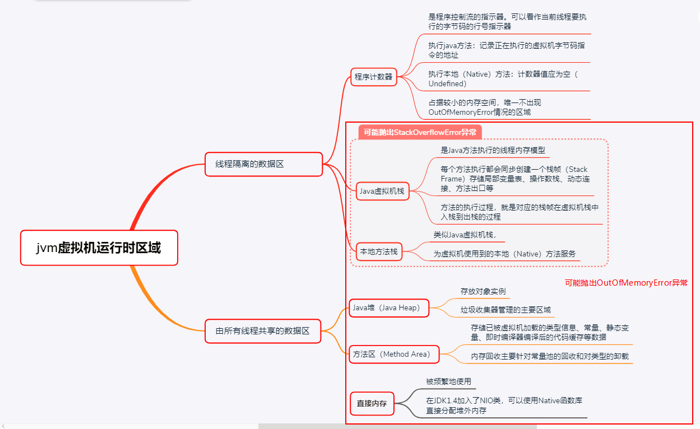

## MemMange



copy from [UnderstandingTheJVM](https://github.com/starjuly/UnderstandingTheJVM/blob/master/%E7%AC%AC%E4%BA%8C%E9%83%A8%E5%88%86-%E8%87%AA%E5%8A%A8%E5%86%85%E5%AD%98%E7%AE%A1%E7%90%86/Ch2-Java%E5%86%85%E5%AD%98%E5%8C%BA%E5%9F%9F%E4%B8%8E%E5%86%85%E5%AD%98%E6%BA%A2%E5%87%BA%E5%BC%82%E5%B8%B8.md)

## Spec

<https://docs.oracle.com/javase/specs/jvms/se8/html/index.html>

## Run-Time Data Areas (From Spec)

### The pc Register 程序计数器

* 每个 JVM 线程都有独立的 pc 寄存器

* 任意时刻 JVM 线程都只会在执行某一个函数， 在执行非 native 函数时 pc 都指向一个 VM instruction，执行 native 函数时则为 null

* pc 的大小足够存放 returnAddress 或者一个平台对应的原生指针

* 不会产生 OOM 异常

### Java Virtual Machine Stacks Java虚拟机栈

* 每个 Java 线程创建的时候会同时创建私有的 Java Virtual Machine stack，用于存储 Frame，和 C 中的 stack 不同， JVM stack 不存储临时变量和函数返回地址等，只 push pop Frame。 Frame 可能是在 heap 上申请的，所以 JVM stack 在内存上不一定连续。

* JVM Stack 的大小可以是在线程创建时固定的，也可以是动态扩展的。

* 计算中线程申请了超过允许大小的 JVM Stack，会抛 StackOverflowError

* 如果 JVM Stack 允许动态扩展，扩展时内存不足则会抛 OutOfMemoryError
* 或者内存不够新建一个新线程的 JVM Stack 时也会抛 OutOfMemoryError

### Heap 堆

* 所有 JVM thread 共享
* class instances 对象 arrays  数组等都存在堆上
* 由 GC 管理
* 扩展到没有内存可用时会抛 OutOfMemoryError 异常
* 使用 `-Xmx -Xms` 指定最大最小值

### Method Area
* 所有 JVM thread 共享，类似 ELF 的 .text 段
* It stores per-class structures such as the run-time constant pool, field and method data, and the code for methods and constructors, including the special methods (§2.9) used in class and instance initialization and interface initialization.
* 存放运行常量池、静态变量、函数、以及特殊的初始化方法等。
* 和Java堆一样，是各个线程共享的内存区域，用于存储已被虚拟机加载的类型信息、常量、静态变量、及时编译器编译后的代码缓存等数据。
类信息：即 Class 类，如类名、访问修饰符、常量池、字段描述、方法描述等。
* 关于“永久代”（Permanent Generation）这个概念：由于HotSpot虚拟机使用“永久代”来实现方法区，故许多Java程序员都习惯把方法区称呼为“永久代”，但这种设计更容易导致内存溢出问题。在JDK6的时候HotSpot开发团队就有放弃永久代，逐步改为采用本地内存（Native Memory）来实现方法区，到了JDK7，已经把原本放在永久代的字符串常量池、静态变量等移除，而到了JDK8，终于完全废弃了永久代的概念，改用了与JPockit、J9一样在本地内存中实现的元空间(Metaspace)中 。
* 垃圾收集行为比较少，甚至可以不实现垃圾收集。这区域的内存回收目标主要是针对常量池的回收和对类型的卸载。
* 无法满足新的内存分配需求时，将抛出OutOfMemoryError异常。


###  Run-Time Constant Pool 运行时常量区
* Class 文件中保存，类似 Symbol Table
* A run-time constant pool is a per-class or per-interface run-time representation of the constant_pool table in a class file

### Native Method Stacks 本地方法栈

* native 方法使用的 C stacks
* 会抛 StackOverflowError 和 OutOfMemoryError


### Example Class

```
javap -v TestOOM
Classfile /mnt/d/codes/openjdk-jdk8u-master/tests/TestOOM.class
  Last modified Apr 1, 2020; size 481 bytes
  MD5 checksum aa707fe3fac01d69eaa1a26cddf5bdcd
  Compiled from "TestOOM.java"
public class TestOOM
  minor version: 0
  major version: 52
  flags: ACC_PUBLIC, ACC_SUPER
Constant pool:
   #1 = Methodref          #8.#21         // java/lang/Object."<init>":()V
   #2 = Class              #22            // java/util/ArrayList
   #3 = Methodref          #2.#21         // java/util/ArrayList."<init>":()V
   #4 = Class              #23            // TestOOM$OOMObject
   #5 = Methodref          #4.#21         // TestOOM$OOMObject."<init>":()V
   #6 = InterfaceMethodref #24.#25        // java/util/List.add:(Ljava/lang/Object;)Z
   #7 = Class              #26            // TestOOM
   #8 = Class              #27            // java/lang/Object
   #9 = Utf8               OOMObject
  #10 = Utf8               InnerClasses
  #11 = Utf8               <init>
  #12 = Utf8               ()V
  #13 = Utf8               Code
  #14 = Utf8               LineNumberTable
  #15 = Utf8               main
  #16 = Utf8               ([Ljava/lang/String;)V
  #17 = Utf8               StackMapTable
  #18 = Class              #28            // java/util/List
  #19 = Utf8               SourceFile
  #20 = Utf8               TestOOM.java
  #21 = NameAndType        #11:#12        // "<init>":()V
  #22 = Utf8               java/util/ArrayList
  #23 = Utf8               TestOOM$OOMObject
  #24 = Class              #28            // java/util/List
  #25 = NameAndType        #29:#30        // add:(Ljava/lang/Object;)Z
  #26 = Utf8               TestOOM
  #27 = Utf8               java/lang/Object
  #28 = Utf8               java/util/List
  #29 = Utf8               add
  #30 = Utf8               (Ljava/lang/Object;)Z
{
  public TestOOM();
    descriptor: ()V
    flags: ACC_PUBLIC
    Code:
      stack=1, locals=1, args_size=1
         0: aload_0
         1: invokespecial #1                  // Method java/lang/Object."<init>":()V
         4: return
      LineNumberTable:
        line 2: 0

  public static void main(java.lang.String[]);
    descriptor: ([Ljava/lang/String;)V
    flags: ACC_PUBLIC, ACC_STATIC
    Code:
      stack=3, locals=2, args_size=1
         0: new           #2                  // class java/util/ArrayList
         3: dup
         4: invokespecial #3                  // Method java/util/ArrayList."<init>":()V
         7: astore_1
         8: aload_1
         9: new           #4                  // class TestOOM$OOMObject
        12: dup
        13: invokespecial #5                  // Method TestOOM$OOMObject."<init>":()V
        16: invokeinterface #6,  2            // InterfaceMethod java/util/List.add:(Ljava/lang/Object;)Z
        21: pop
        22: goto          8
      LineNumberTable:
        line 7: 0
        line 9: 8
      StackMapTable: number_of_entries = 1
        frame_type = 252 /* append */
          offset_delta = 8
          locals = [ class java/util/List ]
}
SourceFile: "TestOOM.java"
InnerClasses:
     static #9= #4 of #7; //OOMObject=class TestOOM$OOMObject of class TestOOM
```